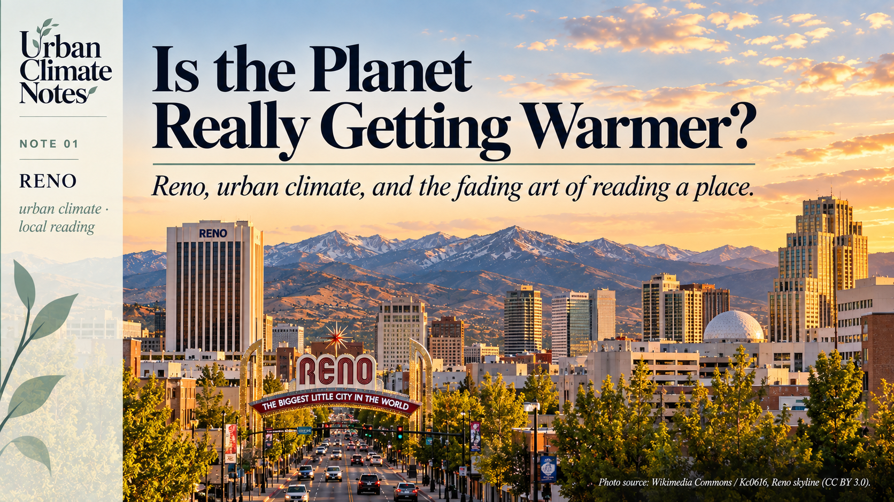
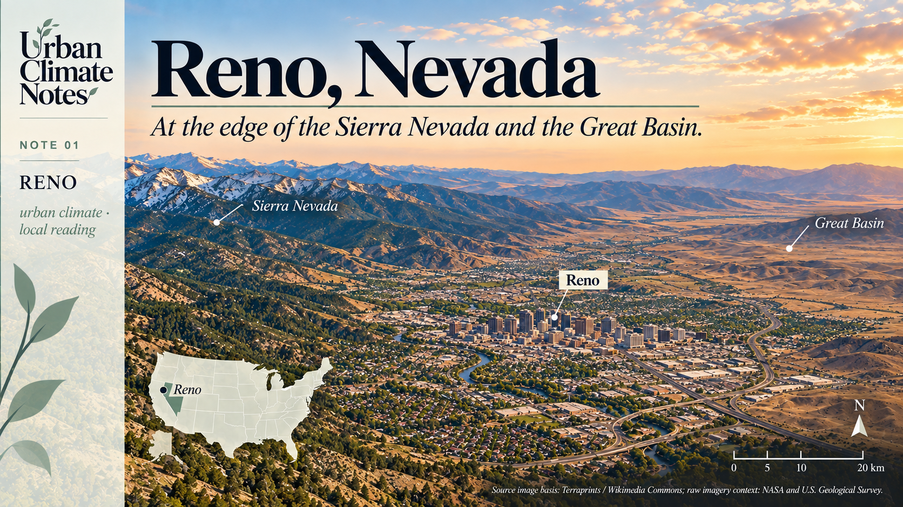
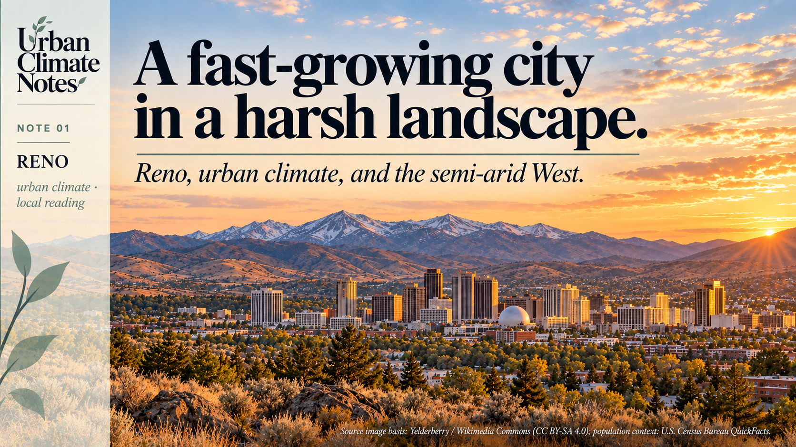
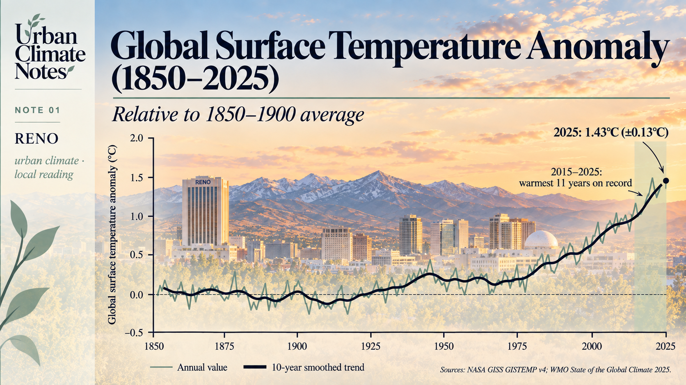

{width="100%" fig-alt="Urban Climate Notes 01. Is the Planet Really Getting Warmer?"}

> **“There was a time when everything … all had a voice and we were able to understand.”**
>
> Benny Fillmore, Washoe Elder [1]

I sometimes think there is an endangered species missing from our conservation lists: **the city dweller who still knows how to read the place they live in.**

Someone who knows which street catches the afternoon wind. Which courtyard holds the heat after sunset. Where water gathers when the rain becomes serious. Someone who looks at a tree and sees, among other things, information about soil, moisture, exposure and time.

This knowledge rarely arrives as a complete theory. It accumulates through living somewhere: a remembered flood, a planting season, a warning repeated until it becomes a proverb.

I have considerable respect for that kind of knowledge.

**Years of observation can survive in an ordinary sentence.**

Much of it once answered to necessity. Getting the season wrong could mean losing a harvest. Building without understanding water could mean losing a home. Sunlight and weather had a seat at the drawing table, whether the builder invited them or not.

Technology has made many of those negotiations less visible.

We can cool a badly oriented room, import food through a failed season and consult a forecast without looking outside.

These are remarkable achievements. They have also made it easier to live somewhere without learning very much about it.

That is one reason I wanted to begin this series on **urban climate**: to think about what our instruments reveal, what our cities remember, and what we have stopped noticing.

## The biggest little city gets warmer

Reno calls itself **“The Biggest Little City in the World.”**

Its famous arch gives the city a compact, confident introduction. [2]

Recently, I encountered another description of Reno, this time in a temperature ranking.

Climate Central analysed annual average temperature trends between 1970 and 2025 for 242 U.S. cities.

Reno showed the largest estimated increase:

**7.9°F, approximately 4.4°C.** [3]

A striking number for a city with “little” in its nickname.

But the geography behind the number is more interesting than the ranking alone.

{width="100%" fig-alt="Reno, Nevada, between the Sierra Nevada and the Great Basin"}

Reno, Nevada, in its regional landscape context, between the Sierra Nevada and the Great Basin.

Reno lies on the eastern side of the Sierra Nevada, in the mountains’ rain shadow.

The landscape helps determine what moisture reaches the city and under what conditions. [4]

**Even before a street is laid out, the place already has a climatic structure.**

This is easy to forget when we encounter cities primarily through their buildings, economies or administrative boundaries.

A city also occupies a position in a system of mountains, winds and water.

Reno is growing within that system.

Its population rose from **225,221 in 2010 to an estimated 283,621 in 2025**, an increase of approximately **26%**. [5]

{width="100%" fig-alt="Reno skyline and the surrounding semi-arid mountain landscape"}

Reno is a fast-growing city within a semi-arid landscape shaped by the Sierra Nevada and the Great Basin.

The population figures do not explain the temperature trend.

They describe a growing population living in a place whose recorded thermal conditions have changed substantially.

Nor is the reported 4.4°C increase a measurement of Reno’s urban heat island.

It is a regression-based estimate from annual temperatures in a local weather-station record.

Separating regional warming from the effects of urban development requires a different analysis.

Still, the combination gives a planner reason to pause.

**As Reno grows, planners will have to make more decisions about buildings and land in a climate that is itself changing.**

## A warm year, or a warming world?

Before discussing street canyons, vegetation or satellite images, we need to establish the larger background.

**Is the planet really warming, or are we simply passing through a warm period?**

The long-term evidence is clear.

The World Meteorological Organization reports that **2015–2025 were the eleven warmest years in the observational record**.

The global mean near-surface temperature in 2025 was approximately **1.43°C above the 1850–1900 average**, with a reported uncertainty of ±0.13°C. [6]

The IPCC concludes that human activities have unequivocally caused global warming.

It also assesses that global surface temperature has risen faster since 1970 than during any other 50-year period over at least the last **2,000 years**. [7]

An individual year can still be cooler than the one before it because natural variability continues within a warming climate.

> **Climate is not a staircase. It is a trend.**

{width="100%" fig-alt="Global surface temperature anomaly from 1850 to 2025"}

Global warming is a long-term trend rather than the result of a single hot year.

We should also resist an easy comparison.

Reno’s **4.4°C change since 1970** and the global anomaly of **1.43°C** use different reference periods and describe different quantities.

Putting them side by side does not tell us how many times faster Reno is warming.

What they do tell us is that **the global story needs local investigation.**

## Buildings still negotiate with the weather

Here is where urban morphology enters.

The climate of a street is partly shaped by the arrangement of its buildings: their height, spacing, orientation and relationship to open space.

That geometry influences sunlight, the exchange of radiation and the movement of air.

Materials, vegetation, water and heat released by human activities also help shape urban thermal conditions. [8]

These processes continue whether or not they appear in the planning brief.

A shaded street may offer relief during the day.

The same enclosing geometry can affect ventilation and the release of heat at night.

The useful question is therefore more precise than whether density is “good” or “bad” for climate:

> **Which configuration, in which climate, at what hour, and for whom?**

This is also where older observations become interesting.

> “The upstairs room is unbearable in August.”

That is not a complete thermal assessment, but it is an observation worth investigating.

> “The water always comes back here.”

That is not a flood model either.

Before dismissing it, I would want to know who remembers, how far that memory reaches, and what has since been built upstream.

Inherited knowledge deserves attention and scrutiny.

Some lessons remain useful, while others need to be reconsidered as land use and climate continue to change.

**Respecting that knowledge means taking it seriously enough to examine.**

## Learning to read again

There is something curious about our present situation.

We can observe the Earth from orbit, yet may know very little about the thermal behaviour of the street outside our door.

A satellite can help us estimate land surface temperature.

A weather station can record air temperature.

Neither, on its own, tells the whole story of someone waiting at an unshaded bus stop.

Radiation, wind and humidity matter too.

For planners, choosing the right measurement is part of understanding the place.

So is listening to the people who use it.

Benny Fillmore’s words belong to a particular Washoe context: relationships with land, knowledge and stewardship around Lake Tahoe. [1]

They deserve more than becoming a pleasant quotation above a graph.

They leave me with a question about attention.

What would it mean to become better readers of our cities, to recognise a climatic consequence in the orientation of a building, a lost opportunity in a sealed courtyard, or a warning in a familiar account of a flood?

We have more instruments than ever.

We also have accumulated experience that deserves another hearing.

The planet is warming.

The next task is to understand how that change meets the places we inhabit.

> **The next Urban Climate Note moves one scale down: if the world is warming, what makes cities different?**

---

## Sources

**[1]** Center for the Study of the Force Majeure. [*Stewarding Knowledges*](https://www.centerforforcemajeure.org/stewarding-knowledges). Benny Fillmore, Washoe Elder, and the initiative’s Washoe-led stewardship context.

**[2]** City of Reno. [*Historic Markers*](https://reno.gov/community/arts-culture/historic-preservation/historic-markers.php). Reno’s nickname and historic arch.

**[3]** Climate Central. [*Fastest-Warming U.S. States and Cities*](https://www.climatecentral.org/climate-matters/fastest-warming-us-cities-and-states). April 22, 2026. The reported changes are based on linear regression of annual average weather-station temperatures over 1970–2025.

**[4]** National Weather Service. [*Climate of Reno, Nevada*](https://preview.weather.gov/media/wrh/online_publications/TMs/TM-276.pdf). Western Region Technical Memorandum 276.

**[5]** U.S. Census Bureau. [*QuickFacts: Reno city, Nevada*](https://www.census.gov/quickfacts/renocitynevada). 2010 census count and July 1, 2025 population estimate, V2025. Percentage growth calculated from the two figures.

**[6]** World Meteorological Organization. [*State of the Global Climate 2025*](https://wmo.int/publication-series/state-of-global-climate/state-of-global-climate-2025). 2026.

**[7]** IPCC. [*Climate Change 2023: Synthesis Report*](https://www.ipcc.ch/report/ar6/syr/downloads/report/IPCC_AR6_SYR_FullVolume.pdf). Summary for Policymakers and Section 2.1.1.

**[8]** IPCC. [*AR6 Working Group I: Regional Fact Sheet: Urban Areas*](https://www.ipcc.ch/report/ar6/wg1/downloads/factsheets/IPCC_AR6_WGI_Regional_Fact_Sheet_Urban_areas.pdf). 2021.