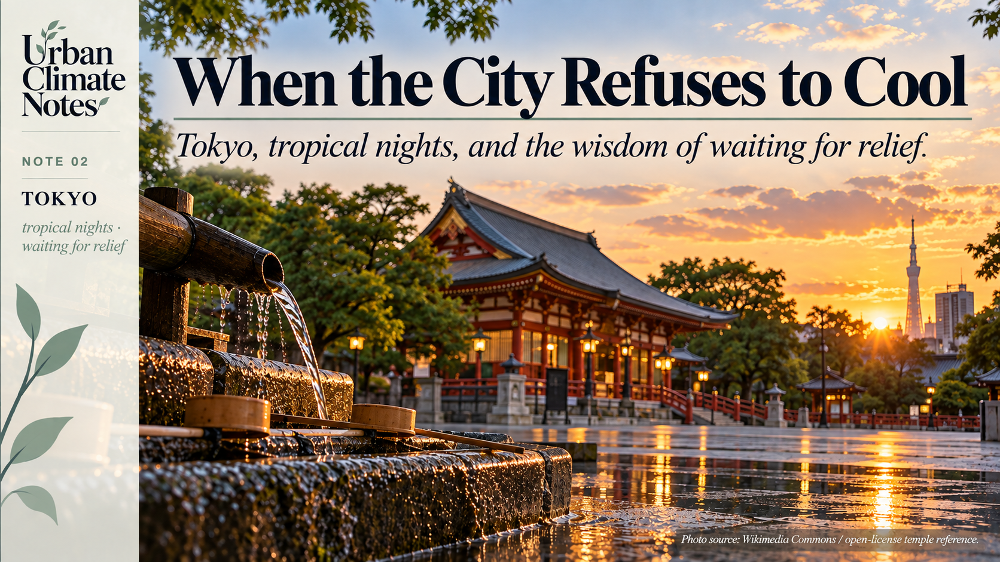
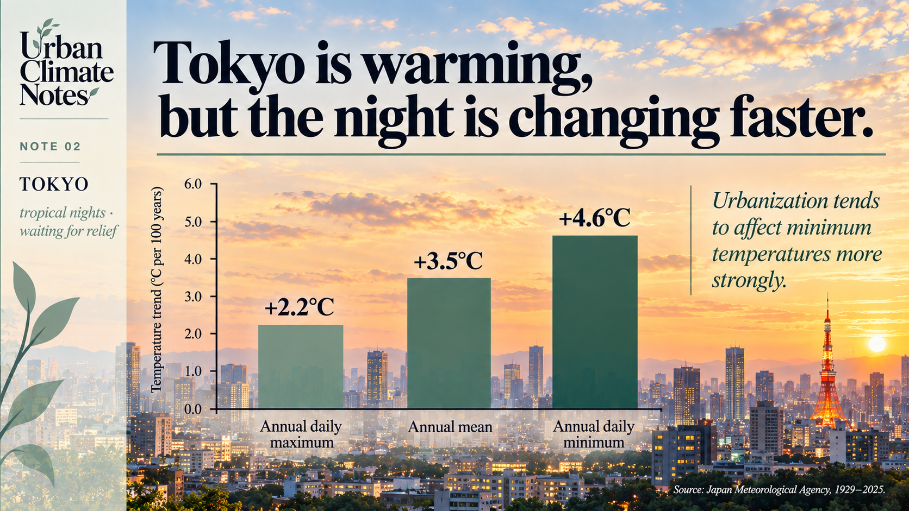
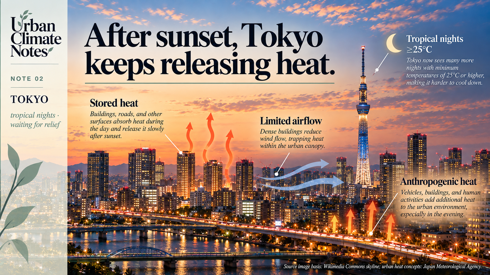
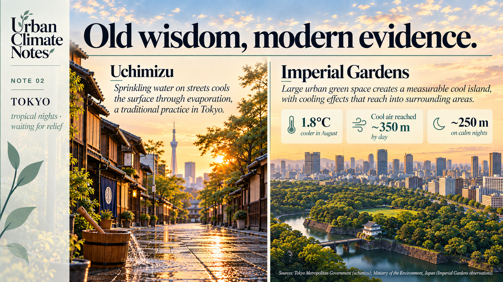

{width="100%" fig-alt="Urban Climate Notes 02. When the City Refuses to Cool"}

> 暑さ寒さも彼岸まで。  
> *Atsusa samusa mo higan made.*
>
> **“The heat and the cold last only until Higan.”** [1]

There is reassurance in this Japanese saying.

The lingering heat of summer will ease around the autumn equinox. Winter’s cold will soften around the spring equinox. Hold on a little longer; the season will turn.

Higan is the seven-day period centred on each equinox, associated with Buddhist observances and remembrance of ancestors. In this saying, the calendar also carries an expectation about the weather. [1]

I like the idea that a sentence can hold both memory and a forecast.

A proverb is not a meteorological model. Yet it can preserve something learned through repeated encounters with a place: when to plant, when to prepare, when relief is likely to arrive.

In the first Urban Climate Note, I wrote about the fading figure of the city dweller who still knows how to read their surroundings.

This saying makes me wonder about the other side of that relationship.

**What happens when the place begins to behave differently from the one people remember?**

And what happens when relief is expected much sooner than the next season, when we are simply waiting for the sun to go down?

## The changing temperature of the night

None of us lives at the global average.

We experience climate in rooms, streets and courtyards. We notice it when a pavement radiates heat through our shoes, or when opening a window fails to bring the relief we expected.

Tokyo offers a revealing example.

For 1929–2025, the Japan Meteorological Agency reports a trend of approximately **3.5°C per century in Tokyo’s annual mean temperature**.

The corresponding trends in annual averages of daily maximum and minimum temperature are **2.2°C and 4.6°C per century**, respectively. [2]

{width="100%" fig-alt="Tokyo long-term temperature trends from 1929 to 2025"}

Tokyo’s annual minimum temperature has increased faster than its annual maximum temperature over the long-term record.

The minimum has risen considerably faster than the maximum.

These are annual trends, not summer-only measurements. They do not establish that every Tokyo neighbourhood behaves alike, or that all the observed warming comes from urbanisation.

JMA adjusts the Tokyo series for the relocation of the observing station.

Even with those qualifications, the contrast draws attention to an important part of urban climate: **what happens to heat after sunset.**

We tend to describe a hot city through its afternoons.

Its nights deserve equal curiosity.

## Sunset does not empty the city of heat

Imagine a street at the end of a summer day.

The sunlight has withdrawn, but the walls and pavement are still warm. During the day, they absorbed and stored energy. Some of that energy is now being released into the surrounding air.

The street’s geometry matters too.

Between buildings, the view of the sky becomes restricted. The *sky-view factor*, meaning the proportion of sky visible from a location, helps describe this enclosure.

A reduced view of the sky can limit radiative cooling, while the arrangement of buildings also affects ventilation.

Vegetation and available moisture influence how energy is divided between heating and evaporation. Human activities add heat as well. These are among the mechanisms JMA identifies behind urban warming. [3]

**The city, in other words, carries part of the afternoon into the night.**

{width="100%" fig-alt="Conceptual illustration of stored heat, limited airflow and anthropogenic heat in Tokyo after sunset"}

After sunset, stored heat, urban geometry and human activities can slow the cooling of the urban environment.

This helps explain the **urban heat island**: the relative warmth of an urban area compared with a less urbanised reference under comparable conditions.

It is distinct from global warming.

Global warming changes the broader climatic background. The urban heat island describes a local thermal difference associated with the characteristics of an urban environment.

A person in a warm bedroom may experience both at once.

The distinction is useful because it points to different scales of action. Reducing greenhouse gas emissions addresses the larger warming trajectory. Changes to the physical and functional characteristics of cities can influence local thermal conditions.

## A name for a night without relief

Japanese meteorological language gives this experience a memorable name:

**A tropical night.**

JMA defines it as a night when the temperature, from evening until the following morning, does not fall below **25°C**. [4]

The term can sound almost inviting, although the experience is usually anything but.

Picture someone turning the pillow over, opening a window, then realising that the air outside offers little relief.

A night can feel long when the cooler hours never arrive.

The threshold is a meteorological category, not a universal boundary between comfort and discomfort.

Rooms differ, bodies differ, and humidity and air movement matter.

Still, it shifts our attention from the day’s peak to its missing respite.

JMA’s long-term analysis shows increasing counts of days with minimum temperatures of at least 25°C in several major Japanese cities.

Tokyo is excluded from that particular comparison because the effect of its station relocation on threshold counts is difficult to remove. [5]

The broader question remains:

**How much opportunity does a city provide to cool between one hot day and the next?**

## A bucket of water, and a lesson in hospitality

Tokyo also offers a much older response to summer heat: **uchimizu**, the sprinkling of water onto the ground.

The Tokyo Metropolitan Government presents it as “Edo wisdom.”

Its account notes that the practice appears in Edo-period haiku and ukiyo-e, and that its purposes extended beyond cooling. It was also used to settle dust, prepare an entrance for guests and cleanse a space. [6]

That detail interests me because it suggests that making a place cooler could also be a way of welcoming someone.

The physical principle is evaporation.

As water evaporates, it draws energy from its surroundings and can cool the wetted surface.

Tokyo’s guidance recommends reused water, applied in shaded places during the morning or evening. [6]

A bucket of water offers a modest intervention. Its effects depend on conditions, and it cannot resolve the thermal problems of a contemporary metropolis.

But the practice still encourages a useful way of thinking about place: look at the surface, consider where the water comes from and pay attention to timing.

## A cooler island within the heat island

In August 2007, researchers working with Japan’s Ministry of the Environment measured temperatures in and around Tokyo’s Imperial Gardens.

The gardens’ average temperature that month was **1.8°C lower than that of the surrounding built-up area**.

Cooler air was detected extending into neighbouring urban areas, up to approximately **350 metres during the day** and approximately **250 metres from midnight into early morning under calm conditions**. [7]

{width="100%" fig-alt="Uchimizu and the cooling influence of Tokyo Imperial Gardens"}

Traditional practices such as uchimizu and measured cooling around large green spaces illustrate two different ways in which water and vegetation can influence urban heat.

These were findings from a particular observation campaign, not distances that every park will reproduce.

What interests me is that the cooling did not stop neatly at the garden boundary.

On a land-use map, a green space can look like a bounded object. In the urban atmosphere, it can participate in exchanges that reach beyond its edge.

For a planner, that changes the question.

We need to consider where cooler spaces sit, what surrounds them, and how their edges connect with streets and buildings.

**A garden belongs to the climate of its neighbourhood as well as to its own grounds.**

## Planning for the hours after sunset

Tokyo brings the first note’s question closer to everyday life.

A warming planet provides the background, while the city’s materials, geometry, vegetation and activities help shape the conditions experienced locally.

For planners, this also means paying attention to time of day.

A building arrangement that provides afternoon shade also needs to be considered in relation to ventilation and cooling after sunset.

A public space should be understood through the hours when people actually use it.

“How hot is this place?” becomes more useful when followed by:

**“When, where, and for whom?”**

The old saying promises that the season will eventually bring relief.

Urban planning asks whether the places we build allow relief to reach us sooner.

I do not think inherited knowledge should be left untouched on a shelf. It deserves to be used, tested and reconsidered in the places we inhabit now.

That reconsideration can begin with an old proverb, a familiar practice such as uchimizu, or measurements taken on either side of a garden wall. Each offers a different way of paying closer attention to how a place behaves.

> **The next Urban Climate Note turns to the city’s physical structure: how do building height, spacing and street geometry shape the heat we experience?**

---

## Sources

**[1]** Shogakukan dictionaries, via Kotobank. [*暑さ寒さも彼岸まで*](https://kotobank.jp/word/暑さ寒さも彼岸まで-425482) and [*彼岸*](https://kotobank.jp/word/彼岸-119265). Meaning of the proverb and the Higan period.

**[2]** Japan Meteorological Agency. [*Urbanisation and long-term trends in mean, maximum and minimum temperature*](https://www.data.jma.go.jp/cpdinfo/himr/himr_1-1-1.html). 1929–2025; annual and seasonal trends, with relocation adjustments for Tokyo.

**[3]** Japan Meteorological Agency. [*What causes the urban heat island?*](https://www.jma.go.jp/jma/kishou/know/cpdinfo/himr_faq/02/qa.html). Heat storage, land cover, urban geometry and anthropogenic heat.

**[4]** Japan Meteorological Agency. [*Frequently asked questions about temperature*](https://www.jma.go.jp/jma/kishou/know/faq/faq3.html). Definition of a tropical night.

**[5]** Japan Meteorological Agency. [*Long-term changes in temperature-category day counts*](https://www.data.jma.go.jp/cpdinfo/himr/himr_1-3.html). The analysis uses daily minimum temperature ≥25°C; Tokyo is excluded because of station-relocation effects.

**[6]** Tokyo Metropolitan Government. [*Uchimizu Biyori: Edo wisdom and Tokyo hospitality*](https://wbgt.metro.tokyo.lg.jp/effort/uchimizu/). Cultural history, evaporative cooling and recommended practice.

**[7]** Ministry of the Environment, Japan. [*Observation of the “Cool Island Effect” in the Imperial Gardens*](https://www.env.go.jp/en/headline/560.html). October 4, 2007; results from observations in August 2007.